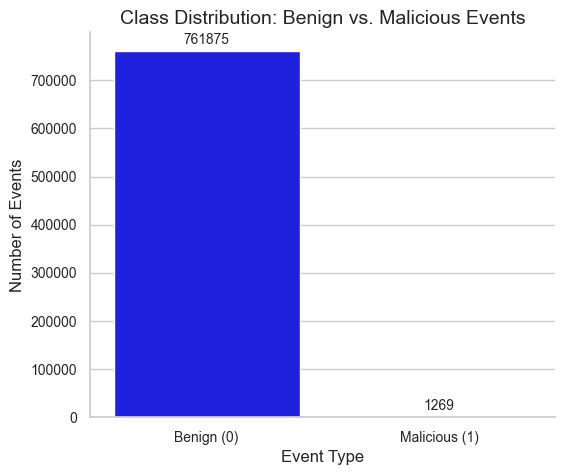
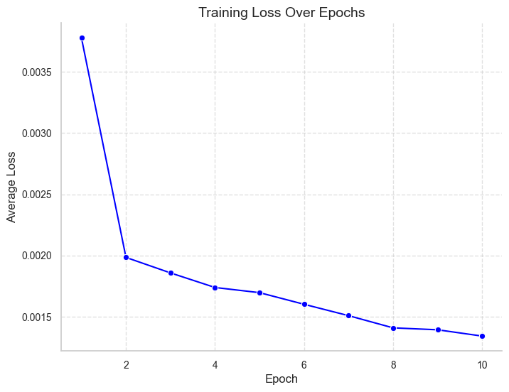
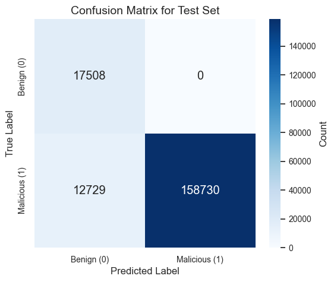

# Deep Learning for Cybersecurity Threat Detection with PyTorch

An end-to-end deep learning project for cybersecurity threat detection using the BETH dataset. This repository provides a complete, step-by-step guide from initial data analysis to building, training, and evaluating a neural network for host-based event classification.

## The Core Problem: Severe Class Imbalance

A core challenge in this project—and in most real-world threat detection scenarios—is **severe class imbalance**. As shown in the exploratory data analysis, the dataset contains a vast majority of benign (normal) events and a very small minority of malicious events.



This imbalance is the central challenge that dictates our entire evaluation strategy. It's the primary reason why standard metrics like accuracy are not suitable for measuring the model's true performance.

## Model Training and Performance

The model was trained for 10 epochs using the Adam optimizer. The training process showed a consistent decrease in the average loss per epoch, indicating that the model was successfully learning patterns from the data.



**Training Progress (Average Loss per Epoch):**
```
Epoch [1/10], Average Loss: 0.0038
Epoch [2/10], Average Loss: 0.0019
Epoch [3/10], Average Loss: 0.0018
Epoch [4/10], Average Loss: 0.0017
Epoch [5/10], Average Loss: 0.0017
Epoch [6/10], Average Loss: 0.0016
Epoch [7/10], Average Loss: 0.0015
Epoch [8/10], Average Loss: 0.0014
Epoch [9/10], Average Loss: 0.0013
Epoch [10/10], Average Loss: 0.0013
```

### Final Performance Metrics

| Dataset    | Accuracy | Precision | Recall   | F1 Score |
|------------|----------|-----------|----------|----------|
| Training   | 0.9997   | 0.9703    | 0.8243   | 0.8914   |
| Validation | 0.9999   | 1.0000    | 0.9885   | 0.9942   |
| Testing    | 0.9460   | 0.9998    | 0.9408   | 0.9694   |

## Analysis: Why We Don't Trust Accuracy

While a 94.6% accuracy on the test set seems high, **accuracy is a dangerously misleading metric for imbalanced datasets.**

Consider this: if 99% of events in a dataset are benign, a lazy model that simply predicts "benign" every single time will achieve 99% accuracy. However, this model would be completely useless, as it would fail to detect **any** threats.

This is why we must use a more nuanced tool for evaluation: the **Confusion Matrix**.

### The Power of the Confusion Matrix

The confusion matrix gives us a clear, transparent view of the model's successes and failures on the unseen test set, especially for the rare malicious class.



From this matrix, we can analyze the four possible outcomes from a cybersecurity perspective:
-   **True Negatives (TN):** Benign events correctly identified as benign.
-   **True Positives (TP):** Malicious events correctly identified as threats. **This is our primary goal.**
-   **False Positives (FP):** Benign events incorrectly flagged as threats. These are **false alarms** that cause alert fatigue for security analysts. Our model's near-perfect Precision score (~0.9998) shows it generated almost no false alarms.
-   **False Negatives (FN):** Malicious events that the model incorrectly labeled as benign. These are the **most dangerous errors**, as they represent **missed threats**.

Our model's **Recall** of **0.9408** on the test set is the most important metric here. It means the model successfully identified **~94%** of all actual threats in the test data, demonstrating a strong detection capability while maintaining extremely high precision.

## Dataset

This project utilizes the **BETH (Botnet Detection in a Hybrid Environment) dataset**, which consists of labeled host-based security events. Each row represents an event characterized by features such as `processId`, `parentProcessId`, `userId`, and `argsNum`. The target label, `sus_label`, indicates whether an event is benign (0) or suspicious (1).

The pre-split dataset (`train`, `validation`, `test`) can be found in the `/data` directory. This dataset was originally part of a project on the DataCamp platform.

## Project Structure

```
beth-threat-detection-pytorch/
│
├── assets/
│   ├── class-imbalance.png
│   ├── training-loss-curve.png
│   └── confusion-matrix.png
│
├── data/
│   ├── labelled_train.csv
│   ├── labelled_validation.csv
│   └── labelled_test.csv
│
├── notebooks/
│   └── cybersecurity-threat-detection-pytorch.ipynb
│
└── README.md
```
